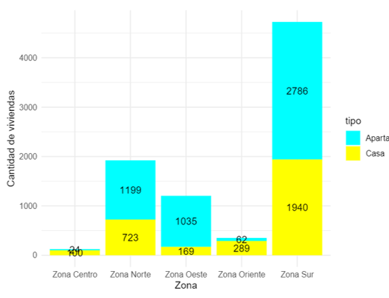

\section{I. Introducción}
Este informe presenta un análisis detallado del mercado inmobiliario en Cali, Colombia, basado en datos de la empresa B&C. El estudio abarca los años 2022 y 2023, un período marcado por fluctuaciones económicas y dinámicas sociales que han impactado la oferta y demanda de bienes raíces. Con la reactivación económica post-pandemia, las políticas gubernamentales incentivaron la compra de viviendas, aunque desafíos como la inflación y el aumento de costos de construcción también jugaron un papel significativo. Usando un conjunto de datos que incluye información sobre propiedades como área construida, número de habitaciones, baños, parqueaderos, precio, y ubicación geográfica, este informe visualiza las principales tendencias del mercado y explora relaciones clave entre variables, brindando una visión clara para la toma de decisiones en el sector inmobiliario.

\section{II. Objetivos}
1. Proporcionar información sobre los precios de las propiedades en distintas zonas de Cali.

2. Brindar detalles acerca de los tipos de viviendas más comunes en el mercado de Cali.

3. Ofrecer información sobre las características más relevantes de la oferta de vivienda en Cali.

4. Soportar la toma de decisiones basándose en:
\begin{itemize}
  \item La definición del nicho de mercado.
  \item Estrategias de marketing.
  \item Establecer precios de venta.
  \item Ofrecer servicios personalizados a los clientes.
\end{itemize}

  
\section{III. Análisis Descriptivo}
```{r setup, include=FALSE}
library(paqueteMETODOS)
library(tidyverse)
library(corrplot)
library(mice)
library(mice)
library(knitr)
library(visdat)
library(naniar)
library(sf)
library(knitr)
library(kableExtra)
library(leaflet)
```

Antes de iniciar la presentación del análisis exploratorio de datos es clave conocer qué contiene el conjunto de datos. Esta exploración preliminar permite corroborar que los datos que tenemos sí son los que esperamos tener. Al haber explorado el dataframe, es posible ver que el conjunto de datos cuenta con la siguiente cantidad de observaciones y variables, respectivamente:

- 8330 filas
- 13 columnas

De esta estructua, se destacan las siguientes variables:

```{r echo=FALSE}
# Datos para la tabla
datos_significado <- data.frame(
  Variable = c(
    "id", "zona", "piso", "estrato", "preciom", 
    "areaconst", "parqueaderos", "banios", "habitaciones", 
    "tipo", "barrio", "longitud", "latitud"
  ),
  Significado = c(
    "Identificador único de la vivienda", "Zona de la ciudad", 
    "Piso en la que está ubicada la vivienda", "Estrato", 
    "Precio en millones de pesos", "Área construida en metros cuadrados", 
    "Número de parqueaderos", "Número de baños", 
    "Número de habitaciones", "Tipo de vivienda", 
    "Barrio", "Coordenada de longitud", "Coordenada de latitud"
  )
)

# Mostrar la tabla
#knitr::kable(
#  datos_significado,
#  col.names = c("Variable", "Significado"),
#  format = "latex",
#  caption = "Descripción de Variables",
#  booktabs = TRUE
#) %>%
#  kableExtra::kable_styling(position = "center")

```

```{r tabla-descrip-variables, echo=FALSE, message=FALSE, warning=FALSE, out.width="70%", fig.align='center'}

```

Una vez se conocen las variables del conjunto de datos, procedemos a identificar si son cuantitativas, cualitativas y categóricas.

\subsection{\textbf{Cuantitativas}}
Las variables cuantitavias son las siguientes:

```{r echo=FALSE, message=FALSE, warning=FALSE}
# Lista de variables cuantitativas
cuantitativas <- c(
  "id", "piso", "estrato", "preciom", "areaconst",
  "parquea", "banios", "habitac", "longitud", "latitud"
)

# Crear una matriz de 2 columnas
cuantitativas_matriz <- matrix(cuantitativas, ncol = 2, byrow = TRUE)

```

```{r tabla-variables-cuantitativas, echo=FALSE, message=FALSE, warning=FALSE, out.width="60%", fig.align='center'}

# Generar la tabla
#knitr::kable(
#  cuantitativas_matriz,
#  col.names = c("Cuantitativa 1", "Cuantitativa 2"),
#  format = "latex",
#  caption = "Tabla de Variables Cuantitativas",
#  booktabs = TRUE
#) %>%
#  kableExtra::kable_styling(position = "center")
```

\subsection{\textbf{Cualitativas}}
```{r echo=FALSE}
# Lista de variables cualitativas
cualitativas <- c("zona", "tipo", "barrio")

# Crear una matriz de 1 columna (3 filas)
cualitativas_matriz <- matrix(cualitativas, nrow = 3, byrow = TRUE)

# Generar la tabla
#knitr::kable(
#  cualitativas_matriz,
#  col.names = c("Variables Cualitativas"),
#  format = "latex",
#  caption = "Tabla de Variables Cualitativas",
#  booktabs = TRUE
#) %>%
#  kableExtra::kable_styling(position = "center")
```

```{r tabla-variables-cualitativas, echo=FALSE, message=FALSE, warning=FALSE, out.width="60%", fig.align='center'}

```


Por otro lado, las anteriores variables cualitativas poseen las siguientes categorías:

\subsection{\textbf{Categorías}}
```{r echo=FALSE}
# Lista de categorías
categorias <- c(
  "Zona Oeste", "Zona Sur", "Zona Norte", "Zona Oriente", "Zona Centro",
  "Apartamento", "Casa", "APARTAMENTO", "casa", "CASA", "apto", "NA"
)

# Crear una matriz de 3 columnas
categorias_matriz <- matrix(categorias, ncol = 3, byrow = TRUE)

# Generar la tabla
#knitr::kable(
#  categorias_matriz,
#  col.names = c("Categoría 1", "Categoría 2", "Categoría 3"),
#  format = "latex",
#  caption = "Tabla de Categorías",
#  booktabs = TRUE
#) %>%
#  kableExtra::kable_styling(position = "center")

```

```{r tabla-categorias, echo=FALSE, message=FALSE, warning=FALSE, out.width="80%", fig.align='center'}

```


\subsection{\textbf{Limpieza}}
A partir del conjunto de datos cargado, se procederá a realizar el proceso de limpieza. Al haber observado las primeras 6 filas del conjunto de datos, se pudo ver que hay una variedad de tipos de propiedades, desde apartamentos hasta casas grandes, ubicadas en diferentes zonas de la ciudad. Los precios y las áreas construidas varían considerablemente.


```{r echo=FALSE}
# Cargar datos
data(vivienda_faltantes)
viviendas <- vivienda_faltantes

#head(viviendas)
#summary(viviendas)
#str(viviendas)

#print(paste0("Dimension: ", dim(viviendas) ) )
```

<!--\newpage 
```{r echo=FALSE, fig.cap="Visualización de los primeros elementos del dataframe", out.width="100%"}

```
-->

\subsubsection{\textbf{Consideraciones para el análisis posterior}}

- Es importante notar que la variable zona y barrio pueden proporcionar información valiosa sobre la ubicación de las propiedades y su relación con el precio.

- Las coordenadas geográficas (longitud y latitud) permiten realizar análisis espaciales.

- Fue necesario identificar patrones y tendencias en los datos, como la relación entre el precio y el área construida, la distribución de los precios por zona, y la frecuencia de cada tipo de propiedad.

Primero calculamos la cantidad y el porcentaje de los datos faltantes por columna:


```{r include=FALSE}
# Estadística descriptiva
descrip_Stats <- summary(viviendas)

# Contamos los valores nulos por columna
valores_nulos <- sapply(viviendas, function(x) sum(is.na(x)))

# Imprimir pisos mínimo y máximo
#print(paste0("Min Pisos: ", which.min(viviendas$piso)))
#print(paste0("Max Pisos: ", which.max(viviendas$piso)))

# Calculamos la cantidad y el porcentaje de valores faltantes
valores_faltantes <- colSums(is.na(viviendas))
porcentaje_valores_faltantes <- (valores_faltantes / nrow(viviendas)) * 100

# Creamos un dataframe con el resumen de los datos faltantes
resumen_data_faltante <- data.frame(
  Variable = names(valores_faltantes),
  Valores_Faltantes = valores_faltantes,
  Porcentaje = round(porcentaje_valores_faltantes, 2)
)

```


```{r echo=FALSE, message=FALSE, warning=FALSE, out.width="90%"}


# Mostrar la tabla con kable y kableExtra
#knitr::kable(
#  resumen_data_faltante,
#  format = "latex",
#  caption = "Resumen de valores faltantes",
#  booktabs = TRUE
#) %>%
#  kableExtra::kable_styling(position = "center")
```

En base a lo anterior, podemos concluir lo siguiente:

- Las variables ***"piso"*** y ***"parqueaderos"*** presentan el mayor porcentaje de valores faltantes, con un ***31.70%*** y ***19.27%*** respectivamente, lo que requiere atención para evitar sesgos en el análisis.

- El resto de las variables, como "zona", "estrato", "preciom", "areaconst", "banios", "habitaciones", "tipo", "barrio", "longitud" y "latitud", muestran un porcentaje mínimo de valores faltantes, todas por debajo del ***0.04%.***.

Ahora para visualizar los patrones de datos faltantes y su relación con otras variables, se utilizaron los gráficos \ref{fig:dist-datos-faltantes-por-vars}, \ref{fig:grafico-barras-faltantes} y \ref{fig:grafico-barras-faltantes}:


```{r dist-datos-faltantes-por-vars, echo=FALSE, message=FALSE, warning=FALSE, out.width="100%", fig.align='center'}

# Visualizamos los valores faltantes por variable
#vis_miss(vivienda, sort_miss = TRUE,
#         cluster = TRUE)
```


```{r grafico-barras-faltantes, echo=FALSE, message=FALSE, warning=FALSE, out.width="100%", fig.align='right'}


# Visualizamos los valores faltantes por variable
#ggplot(resumen_data_faltante, aes(x = Variable, y = Valores_Faltantes)) +
#  geom_bar(stat = "identity", fill = "steelblue") +
#  geom_text(aes(label = Valores_Faltantes), 
#            vjust = -0.3) +
#  labs(title = "Valores Faltantes por Variable",
#       x = "Variable",
#       y = "Número de Valores Faltantes") +
#  theme_minimal()
```


```{r echo=FALSE, out.width="100%", message=FALSE, warning=FALSE, out.width="100%"}

#boxplot(viviendas$piso, viviendas$parquea,
#        names = c("Pisos", "Parqueaderos"),
#        col = c("lightblue", "lightgreen"),
#        ylab = "Número",
#        xlab = "Variable")
```

<!-- \newpage -->
\subsection{\textbf{Observaciones generales}}

- **Distribución de pisos y parqueaderos:** Tanto el número de pisos como el de parqueaderos presentan una distribución similar, con una ligera tendencia hacia valores más bajos. Esto indica que la mayoría de las viviendas tienen un número reducido de pisos y parqueaderos.

- **Asimetría positiva:** La distribución de ambas variables muestra una leve asimetría positiva, lo que significa que hay una mayor concentración de datos en la parte inferior del rango, con una cola más larga hacia los valores más altos. Esto sugiere que existen algunas viviendas con un número significativamente mayor de pisos o parqueaderos.

- **Mediana:**  Comparando la mediana de parqueaderos (2) con el número promedio de vehículos por hogar en [zona], se observa que, en promedio, las viviendas cuentan con un número de parqueaderos ligeramente inferior al número de vehículos. Esto sugiere que algunos hogares podrían tener más de un vehículo por vivienda.

- **Valores atípicos:** Se observan valores atípicos en ambas variables, tanto en el extremo superior como en el inferior. Estos valores extremos podrían corresponder a viviendas con características inusuales, como edificios muy altos o casas muy pequeñas, o podrían ser el resultado de errores en la data.

- **Dispersión:** A pesar de la presencia de valores atípicos, la dispersión de los datos, medida por el rango intercuartílico, es relativamente similar entre ambas variables. Esto sugiere que, en general, existe una variabilidad similar en el número de pisos y parqueaderos.

\subsection{\textbf{Frecuencia de tipos de vivienda}}
Si nos fijamos en los tipos de propiedades, vemos un pequeño error en cuanto a la división de los tipos de vivienda, en donde se registraron con diferentes nomenclaturas. Esto se aprecia a continuación:\

```{r echo=FALSE}
# Tabla de contingencia actualizada
tabla_tipos_vivienda <- table(viviendas$tipo) %>%
  as.data.frame() %>%
  rename(Tipo_de_Vivienda = Var1, Frecuencia = Freq)

# Si nos fijamos en los tipos de propiedades, vemos un pequeño error en cuanto a la división de los tipos de vivienda, en donde se registraron con diferentes nomenclaturas. Arreglaremos esto con un diccionario de sinónimos

### Diccionario de sinónimos
sinonimos <- c("Apartamento" = "Apartamento", "APARTAMENTO" = "Apartamento", 
               "apto" = "Apartamento", "casa" = "Casa", "Casa" = "Casa", "CASA" = "Casa")

# Reemplazar sinónimos en la columna "tipo"
viviendas$tipo <- plyr::revalue(viviendas$tipo, replace = sinonimos)

# TVerificamos que se hizo el cambio correctamente
#table(vivienda$tipo)

```

```{r echo=FALSE, out.width="100%", fig.align='left'}

```

\
Lo anterior nos permite verificar que, después de la imputación de datos, todas las categorías de tipo presentan una proporción de 0 en valores faltantes para la variable ‘piso’, lo que indica que se han imputado correctamente todos los valores faltantes en esta columna, eliminando cualquier NA y demostrando la efectividad del proceso de imputación sin diferencias en la proporción de valores faltantes entre los distintos tipos de propiedades.\

<!--\newpage  -->
Además, al analizar la relación entre los valores faltantes de ‘piso’ y el ‘tipo’, la figura \ref{fig:bar-chart-proporcion-viviendas} revela que la imputación ha sido exitosa en todas las categorías, consolidando la ausencia de valores faltantes y asegurando la integridad de los datos en la variable ‘piso’.

```{r bar-chart-proporcion-viviendas, echo=FALSE, out.width="100%", fig.align='center'}


#ggplot(vivienda, aes(x = tipo, fill = is.na(piso))) +
#  geom_bar(position = "fill") +
#  labs(x = "Tipo de Propiedad",
#       y = "Proporción de Valores Faltantes")

```


\subsection{\textbf{Barrio}}
La variable barrio será modificada iniciando con el cambio del texto a minúscula, remoción de tildes y posteriomente el reemplazo de valores en las categorías donde existan nombres similares. El cambio se ve a continuación, la cantidad de barrios pasa de 436 a 370.\

```{r include=FALSE}
viviendas$barrio <- iconv(viviendas$barrio, to = "ASCII//TRANSLIT") 
viviendas$barrio <- ifelse(viviendas$barrio == "agua blanca", "aguablanca", viviendas$barrio) 
viviendas$barrio <- ifelse(viviendas$barrio == "alf?Crez real", "alferez real", viviendas$barrio) 
viviendas$barrio <- ifelse(viviendas$barrio == "alfonso lopez i", "alfonso lopez", viviendas$barrio) 
viviendas$barrio <- ifelse(viviendas$barrio == "base a?Crea", "base area", viviendas$barrio) 
viviendas$barrio <- ifelse(viviendas$barrio == "calibella", "cali bella", viviendas$barrio) 
viviendas$barrio <- ifelse(viviendas$barrio == "calicanto", "cali canto", viviendas$barrio) 
viviendas$barrio <- ifelse(viviendas$barrio == "ciudad mel?Cndez", "ciudad melendez", viviendas$barrio) 
viviendas$barrio <- ifelse(viviendas$barrio == "ciudadela pasoancho", "ciudadela paso ancho", viviendas$barrio) 
viviendas$barrio <- ifelse(viviendas$barrio == "el ingenio 3", "el ingenio iii", viviendas$barrio) 
viviendas$barrio <- ifelse(viviendas$barrio == "el tr?Cbol", "el trebol", viviendas$barrio) 
viviendas$barrio <- ifelse(viviendas$barrio == "ingenio", "el ingenio", viviendas$barrio) 
viviendas$barrio <- ifelse(viviendas$barrio == "ingenio i", "el ingenio i", viviendas$barrio) 
viviendas$barrio <- ifelse(viviendas$barrio == "ingenio ii", "el ingenio ii", viviendas$barrio) 
viviendas$barrio <- ifelse(viviendas$barrio == "juanamb??", "juanambu", viviendas$barrio) 
viviendas$barrio <- ifelse(viviendas$barrio == "laflora", "la flora", viviendas$barrio) 
viviendas$barrio <- ifelse(viviendas$barrio == "las am?Cricas", "las americas", viviendas$barrio) 
viviendas$barrio <- ifelse(viviendas$barrio == "las vegas de", "las vegas", viviendas$barrio) 
viviendas$barrio <- ifelse(viviendas$barrio == "mel?Cndez", "melendez", viviendas$barrio) 
viviendas$barrio <- ifelse(viviendas$barrio == "pampalinda", "pampa linda", viviendas$barrio) 
viviendas$barrio <- ifelse(viviendas$barrio == "rep??blica de israel", "republica de israel", viviendas$barrio) 
viviendas$barrio <- ifelse(viviendas$barrio == "tequendema", "tequendama", viviendas$barrio) 
viviendas$barrio <- ifelse(viviendas$barrio == "valle de lili", "valle del lili", viviendas$barrio) 
viviendas$barrio <- ifelse(viviendas$barrio == "zona norte los", "zona norte", viviendas$barrio) 
distinct(viviendas, pick("barrio"))
```

```{r echo=FALSE, out.width="80%" }
tabla_barrios <- distinct(viviendas, barrio) %>% head(10)


# Mostrar la tabla en dos columnas
#knitr::kable(
#  matrix(tabla_barrios$barrio, ncol = 2, byrow = TRUE),
#  col.names = c("Barrio Corregido", "Barrio Corregido"),
#  format = "latex",
#  longtable = FALSE,
#  booktabs = TRUE,
#  caption = "Correcciones en los nombres de los barrios"
#) %>%
#  kableExtra::kable_styling(position = "center")
```

<!--\subsection{\textbf{Latitud y Longitud}}-->

```{r include=FALSE}
sin_decimales_long <- viviendas$longitud[!grepl("\\.", as.character(viviendas$longitud))]  
sin_decimales_long <- sin_decimales_long / 1000  
viviendas$longitud[!grepl("\\.", as.character(viviendas$longitud))] <- sin_decimales_long  
sin_decimales_lat <- viviendas$latitud[!grepl("\\.", as.character(viviendas$latitud))]  
sin_decimales_lat <- sin_decimales_lat / 1000  
viviendas$latitud[!grepl("\\.", as.character(viviendas$latitud))] <- sin_decimales_lat
```

\subsection{\textbf{Eliminación de valores NA}}

```{r echo=FALSE}
id_na <- filter(viviendas, is.na(viviendas$id)) %>% 
  as.data.frame()
#print(id_na)
```

```{r echo=FALSE}
viviendas <- viviendas[complete.cases(viviendas[ , 1]),]
#head(viviendas)
```
Se decide eliminar los valores NA de todas las variables, menos las de las columnas de 'parqueadero' y 'piso' al representar un alto porcentaje de datos faltantes en comparación con las demás. Teniendo en cuenta lo previo, se puede visualizar que los 3 registros no contienen información en ninguna de sus 13 variables por lo que serán eliminados. A continuación, se muestra nuevamente la tabla de los valores NA.

```{r echo=FALSE, message=TRUE, warning=FALSE, out.width="50%", fig.align='center'}
faltantes <- colSums(is.na(viviendas)) %>% 
  as.data.frame()  
#print(faltantes)


# Mostrar la tabla con kable y kableExtra
#knitr::kable(
#  faltantes,
#  format = "latex",
#  caption = "Después de eliminar datos NA",
#  booktabs = TRUE
#) %>%
#  kableExtra::kable_styling(position = "center")


```

\subsection{\textbf{Visualización}}
En esta etapa, nos enfocaremos en dar respuesta a los objetivos propuestos al inicio. Para ello, haremos uso de gráficos que permitan visualizar la información.

\subsection{\textbf{¿Cuál es el precio de las viviendas en diferentes zonas?}}
En este caso se agregó la variable precio por metro cuadrado (precio_m2) a la base para usarla dentro del análisis. Adicionalmente, se dividirá la visualización en 3 secciones por la variable tipo: apartamento y casa, casa y apartamento.\

\subsubsection{\textbf{Apartamento y casa}}\
El mapa que se muestra a continuación permite observar la distribución del precio por zonas teniendo en cuenta casas y apartamentos.

```{r echo=FALSE, message=TRUE, warning=FALSE, out.width="80%", fig.align='center'}


```


```{r eval=FALSE, message=FALSE, warning=FALSE, include=FALSE}
leaflet(data = viviendas) %>%
  addTiles() %>%
  addCircleMarkers(lng = ~longitud, lat = ~latitud,
                   color = ~ifelse(tipo == "Apartamento", "blue", "green"),
                   popup = ~paste0("Precio: ", preciom, "<br>Tipo: ", tipo),
                   radius = 3)
```

La siguiente tabla muestra los valores del promedio y la mediana para las variables precio y precio por metro cuadrado de casas y apartamentos.

```{r echo=FALSE, message=FALSE, warning=FALSE, out.width="90%", fig.align='center'}
# Suponiendo que tu DataFrame se llama "datos_viviendas"
tabla_resumen <- viviendas %>%
  group_by(zona, tipo) %>%
  summarize(
    precio_promedio_m2 = mean(preciom),
    precio_mediana = median(preciom)
  )


# Crear una tabla formateada
#kable(tabla_resumen, 
#     caption = "Precio Promedio y Mediana por Zona y Tipo de Vivienda",
#     booktabs = TRUE,
#     linesep = c("\\midrule", "\\midrule"),
#     align = 'c',  # Mantén 'align = 'c'' para centrar el contenido por defecto
#     col.names = c("Zona", "Tipo", "Precio Promedio/m2", "Precio Mediana"),
#     format = "latex",
#     escape = FALSE) %>%
#  kable_styling(font_size = 6, latex_options = c("striped", "hold_position", "scale_down", "center")) %>%
#  column_spec(1:2, width = "1cm") %>%
#  column_spec(3:4, width = "2cm") %>%
#  row_spec(0, bold = T)

```

\subsection{\textbf{¿Cuál es el tipo de vivienda más ofertada?}}
A continuación, en la figura \ref{fig:pie-chart-viviendas} se usa un gráfico de tipo torta o pie para visualizar la distribución de los tipos de viviendas en Cali.

```{r pie-chart-viviendas, echo=FALSE, fig.align='right', message=FALSE, warning=FALSE, out.width="90%"}
tipo_counts <- table(viviendas$tipo)


# Create the pie chart
#ggplot(data = as.data.frame(tipo_counts), aes(x = "", y = Freq, fill = Var1)) +
#  geom_bar(width = 1, stat = "identity") +
#  coord_polar("y", start=0) +
#  geom_text(aes(label = paste0(round(Freq/sum(Freq)*100), "%")), position = position_stack(vjust = 0.5)) +
#  labs(fill = "Tipo de Vivienda") +
#  theme_void()
```
\subsection{\textbf{¿Cuáles son las características más relevantes?}}
**1. Precio y precio por metro cuadrado**\
A continuación, se comparan las variables precio (preciom) y precio por metro cuadrado (precio_m2) usando un gráfico de cajas.\newpage


```{r echo=FALSE, out.width="100%"}
# Agrupar por zona y calcular estadísticas descriptivas
vivienda_por_zona <- viviendas %>%
  group_by(zona) %>%
  summarize(precio_medio = mean(preciom),
            desv_std = sd(preciom))

# Agrupar por tipo de vivienda y calcular estadísticas descriptivas
vivienda_por_tipo <- viviendas %>%
  group_by(tipo) %>%
  summarize(precio_medio = mean(preciom),
            desv_std = sd(preciom))


# Gráfico de boxplot Precios por Zona
#ggplot(viviendas, aes(x = zona, y = preciom, fill = zona)) +
#  geom_boxplot() +
#  labs(x = "Zona",
#       y = "Precio (millones COP)") +
#  theme_minimal() +
#  theme(legend.position = "none")

```

```{r echo=FALSE, out.width="100%"}


# Gráfico de boxplot por Tipo de Vivienda
#ggplot(viviendas, aes(x = tipo, y = preciom, fill = tipo)) +
#  geom_boxplot() +
#  labs(x = "Tipo de Vivienda",
#       y = "Precio (millones COP)") +
#  theme_minimal() +
#  theme(legend.position = "none")
```

```{r echo=FALSE, out.width="100%"}
# Gráfico de dispersión con color por tipo de vivienda


#ggplot(viviendas, aes(x = tipo, y = preciom/areaconst, fill = tipo)) +
#  geom_boxplot() +
#  labs(x = "Tipo de Vivienda",
#       y = "Precio por Metro Cuadrado (m²)") +
#  theme_minimal() +
#  theme(legend.position = "none")
```

**2. Precio por zona**\
Por otro lado, se realizó un gráfico de barras para poder comparar la distribución de los tipos de viviendas y sus características propias:

```{r echo=FALSE, out.width="100%"}

viviendas_agrupadas_zona_tipo <- viviendas %>%
  count(zona, tipo)




#ggplot(viviendas_agrupadas_zona_tipo, aes(x = zona, y = n, fill = tipo)) +
#  geom_col(position = "stack") +
#  geom_text(aes(label = n), position = position_stack(vjust = 0.5)) +
#  scale_fill_manual(values = c("cyan", "yellow")) +
#  labs(x = "Zona",
#       y = "Cantidad de viviendas") +
#  theme_minimal()

```

**3. Viviendas por Piso**\
```{r echo=FALSE, warning=FALSE, message=FALSE, out.width="100%"}

# Agrupar los datos por piso y tipo
viviendas_piso_tipo <- viviendas %>%
  count(piso, tipo)


# Crear el gráfico de barras apiladas
#ggplot(viviendas_piso_tipo, aes(x = piso, y = n, fill = tipo)) +
#  geom_col(position = "stack") +
#  geom_text(aes(label = n), position = position_stack(vjust = 0.5)) +
#  labs(x = "Piso", y = "Cantidad de viviendas", fill = "Tipo de vivienda") +
#  theme_minimal()

```


**Análisis por Área Construida**\
Para este análisis usamos un diagrama de tipo histograma
```{r echo=FALSE, message=FALSE, warning=FALSE, out.width="100%"}


#ggplot(viviendas, aes(x = areaconst)) +
#  geom_histogram(binwidth = 25, fill = "steelblue", color = "black") +
#  geom_vline(xintercept = 150, color = "red", size = 1) +
#  labs(x = "Área construida (m²)", y = "Frecuencia") +
#  theme_minimal()

```

**Habitaciones**\
Ahora veremos la información relacionada con las habitaciones
```{r echo=FALSE, message=FALSE, warning=FALSE, out.width="100%"}
viviendas_habitaciones_tipo <- viviendas %>%
  count(habitac, tipo)


#ggplot(viviendas_habitaciones_tipo, aes(x = habitac, y = n, fill = tipo)) +
#  geom_col(position = "stack") +
#  geom_text(aes(label = n), position = position_stack(vjust = 0.5)) +
#  labs(x = "Número de habitaciones", y = "Cantidad de viviendas", fill = "Tipo de vivienda") +
#  theme_minimal()
```
**Estrato**\
A continuación, veremos la información relacionada con la variable estrato.
```{r echo=FALSE, message=FALSE, warning=FALSE, out.width="100%"}
viviendas_habitaciones_tipo <- viviendas %>%
  count(estrato, tipo)


# Crear el gráfico de barras apiladas
#ggplot(viviendas_habitaciones_tipo, aes(x = estrato, y = n, fill = tipo)) +
#  geom_col(position = "stack") +
#  geom_text(aes(label = n), position = position_stack(vjust = 0.5)) +
#  labs(x = "Número de habitaciones", y = "Cantidad de viviendas", fill = "Tipo de vivienda") +
#  theme_minimal()
```

**Número de parqueaderos**\
Ahora veremos la información relacionada con el número de parqueaderos.
```{r echo=FALSE, message=FALSE, warning=FALSE, out.width="100%"}
viviendas_habitaciones_tipo <- viviendas %>%
  count(parquea, tipo)


# Crear el gráfico de barras apiladas
#ggplot(viviendas_habitaciones_tipo, aes(x = parquea, y = n, fill = tipo)) +
#  geom_col(position = "stack") +
#  geom_text(aes(label = n), position = position_stack(vjust = 0.5)) +
#  labs(x = "Número de habitaciones", y = "Cantidad de viviendas", fill = "Tipo de vivienda") +
#  theme_minimal()
```


**Baños**\
Ahora veremos la información relacionada con la cantidad de baños.
```{r echo=FALSE, message=FALSE, warning=FALSE, out.width="100%"}
viviendas_habitaciones_tipo <- viviendas %>%
  count(banios, tipo)


# Crear el gráfico de barras apiladas
#ggplot(viviendas_habitaciones_tipo, aes(x = banios, y = n, fill = tipo)) +
#  geom_col(position = "stack") +
#  geom_text(aes(label = n), position = position_stack(vjust = 0.5)) +
#  labs(x = "Número de habitaciones", y = "Cantidad de viviendas", fill = "Tipo de vivienda") +
#  theme_minimal()
```

**Análisis de correlación**\
Calcularemos una matriz de correlación para identificar las variables que están más fuertemente relacionadas con el precio

```{r echo=FALSE, warning=FALSE, message=FALSE, out.width="100%"}
# Calcular la matriz de correlación
matriz_correlacion <- cor(viviendas[, c("preciom", "areaconst", "habitac", "banios")])


# Crear el gráfico de correlación
#corrplot(matriz_correlacion, method = "color", 
#         type = "upper", order = "hclust", 
#         tl.col = "black", tl.srt = 45, 
#         addCoef.col = "red", number.cex = 0.8)


```

De lo anterior, se puede decir que la correlación entre:

1. **Precio y Área Construida:** El coeficiente de correlación de 0.687 muestra una relación positiva fuerte, indicando que, en general, propiedades más grandes tienen precios más altos.

2. **Precio y Número de Habitaciones:** El coeficiente de 0.263 sugiere una relación positiva moderada, pero menos intensa que la observada entre el precio y el área construida.

3. **Área Construida y Número de Habitaciones:** El coeficiente de 0.517 indica una relación positiva moderada, lo cual es lógico ya que propiedades más grandes tienden a tener más habitaciones.

4. **Precio y Número de Baños:** Existe una correlación positiva fuerte entre el precio y el número de baños. Esto indica que propiedades con más baños tienden a tener precios más altos.

\subsection{\textbf{Nicho de mercado}}
Para respaldar la toma de decisiones en relación con el nicho de mercado, se llevará a cabo un análisis separado según el tipo de vivienda. Además, el nicho de mercado está estrechamente vinculado con las ventas y, por ende, con el precio. En este contexto, las principales variables de análisis serán el precio y el precio por metro cuadrado. Las variables adicionales a considerar incluirán aspectos relacionados con la venta o características del inmueble que influyen en el cliente, tales como la **zona y el estrato.** La variable barrio no se incluirá debido a la gran cantidad de valores únicos.\

\newpage
**Apartamentos**\
```{r echo=FALSE, warning=FALSE, message=FALSE, out.width="100%"}
resultados <- viviendas %>%
  group_by(zona, tipo) %>%
  summarize(
    precio_promedio_m2 = mean(preciom),
    precio_mediana = median(preciom)
  )


#ggplot(viviendas, aes(x = preciom)) +
#  geom_histogram(binwidth = 20, fill = "cyan", color = "black") +
#  geom_vline(xintercept = 300, color = "magenta") +  # Ajusta el valor de xintercept si es necesario
#  labs(title = "Histograma de Precios",
#       x = "Precio (millones)",
#       y = "Frecuencia") +
#  theme_minimal()
```

```{r echo=FALSE, warning=FALSE, message=FALSE, out.width="100%"}


#ggplot(viviendas, aes(x = preciom)) +
#  geom_histogram(binwidth = 20, fill = "cyan", color = "black") +
#  geom_vline(xintercept = mean(viviendas$preciom), color = "magenta", size = 1.2) +
#  labs(title = "Distribucion de Precios por Metro Cuadrado",
#       x = "Precio por Metro Cuadrado (COP)",
#       y = "Numero de Viviendas") +
#  theme_minimal()
```

\section{IV. Resultados}
A continuación se listan los resultados basados en el ejercicio de visualización de la sección anterior:

\subsection{\textbf{Información sobre precio de viviendas}}
El precio promedio del costo total y costo por metro cuadrado de las viviendas en diferentes zonas de Cali, teniendo en cuenta **ambos tipos de vivienda**, es:\

- Zona Centro: 310 millones, 1,75 millones/m^2
- Zona Norte: 346 millones, 2,45 millones/m^2
- Zona Oeste: 679 millones, 3,65 millones/m^2
- Zona Oriente: 229 millones, 1,44 millones/m^2
- Zona Sur: 426 millones, 2,72 millones/m^2

El precio promedio del costo total y costo por metro cuadrado de las viviendas en diferentes zonas de Cali, teniendo en cuenta solo los **apartamentos**, es:\

- Zona Centro: 187 millones, 1,95 millones/m^2
- Zona Norte: 285 millones, 2,81 millones/m^2
- Zona Oeste: 669 millones, 3,85 millones/m^2
- Zona Oriente: 153 millones, 1,69 millones/m^2
- Zona Sur: 297 millones, 2,98 millones/m^2

El precio promedio del costo total y costo por metro cuadrado de las viviendas en diferentes zonas de Cali, teniendo en cuenta solo las casas, es:\

- Zona Centro: 339 millones, 1,69 millones/m^2
- Zona Norte: 446 millones, 1,84 millones/m^2
- Zona Oeste: 736 millones, 2,38 millones/m^2
- Zona Oriente: 244 millones, 1,38 millones/m^2
- Zona Sur: 612 millones, 2,33 millones/m^2

\subsection{\textbf{Tipo de vivienda más ofertada}}
El tipo de vivienda más ofertada en Cali es:
- Apartamento: 61%
- Casa: 39%


\subsection{\textbf{Caracteristicas relevantes}}
- **Precio:** además de los resultados del precio mencionados anteriomente, la distribución del precio en millones de apartamentos se encuentra por encima cuando se evalua teniendo en cuenta el área construida.
- **Zona:** la zona sur, norte y oeste tienen la mayor proporción de oferta de viviendas.
- **Piso:** las casas y apartamentos tienen proporciones similares de piso 1-3. A partir de piso 4 la participación de los apartamentos se lleva la mayor proporción.
- **Área construida:** la variable se distribuye principalmente entre 0 y 400 metros cuadrados, la mediana es 123 metros cuadrados.
- **Número de habitaciones:** la variable tiene mayor participación de apartamentos entre 0-3 habitaciones, a partir de 4 la participación es mayor en casas.
- **Estrato:** el estrato 5 se lleva la mayor proporción de oferta de vivienda teniendo más participación de apartamentos que de casas.
- **Número de parqueaderos:** De 1 a 3 parqueaderos tiene la mayor proporción de oferta de vivienda teniendo más participación de apartamentos que de casas. A partir de 4 parqueaderos las casas tienen más participación.
- **Baños:** De 1 a 3 baños tiene la mayor proporción de oferta de vivienda teniendo más participación de apartamentos que de casas. A partir de 4 baños las casas tienen más participación.

\subsection{\textbf{Nicho de mercado}}
**Apartamento**\newline
- **Precio:** el precio por metro cuadrado se podría ubicar entre 1 y 2 millones o entre 4 y 6 millones.\
- **Zona:** la zona podría estar en norte o en oeste/sur.\
- **Estrato:** el estrato podría estar en 3 o 5-6.\
- **Precio:** el precio por metro cuadrado se podría ubicar entre 0 y 1 millones o entre 3 y 5 millones.\
- **Zona**: la zona podría estar en oriente o en oeste/sur.\
- **Estrato**:el estrato podría estar en 3 o 5-6.\

\section{\textbf{Nicho de mercado}}

\subsection{\textbf{Información de precio}}
La información sobre los precios de las viviendas en Cali se puede analizar considerando ambos tipos de propiedad: apartamentos y casas. En el caso de los apartamentos, las zonas oeste y sur presentan los valores promedio más altos, con 3,65 y 2,72 millones por metro cuadrado, respectivamente. Para los apartamentos, las zonas oeste y sur siguen destacándose con promedios de 3,85 y 2,98 millones por metro cuadrado, aunque la zona norte está bastante cerca, con 2,81 millones por metro cuadrado. En cuanto a las casas, las zonas oeste y sur mantienen el mismo patrón, con promedios de 2,38 y 2,33 millones por metro cuadrado.

\subsection{\textbf{Tipo de vivivenda más ofertada}}
El tipo de vivienda con mayor participación en el mercado de Cali es el apartamento, que representa el 61% de la oferta, mientras que las casas constituyen el 39%.

\subsection{\textbf{Características a destacar}}
1. El análisis del precio por metro cuadrado ofrece una visión más clara del costo de la vivienda. Aunque las casas tienen un precio globalmente más alto sin considerar el área, al evaluar el precio por metro cuadrado, se observa que el 75% de los datos de apartamentos se sitúa cerca de 4 millones por metro cuadrado, mientras que el mismo porcentaje para las casas está alrededor de 3 millones por metro cuadrado.

2. Las zonas sur, norte y oeste presentan la mayor proporción de oferta de vivienda, con el 56%, 23% y 14%, respectivamente. El patrón de pisos de las casas, que usualmente tienen de 1 a 3 pisos, contrasta con los apartamentos, que predominan en edificios y, por lo tanto, tienen una mayor participación en el mercado.

3. Para el área construida, se utilizó la mediana debido a la presencia de valores extremos. Esta área varía entre 0 y 400 metros cuadrados, y dado que los apartamentos tienen una mayor proporción, es consistente que su mediana sea de 123 metros cuadrados. El número de habitaciones, baños y parqueaderos sigue una tendencia similar, con una mayor proporción en apartamentos de 1 a 3 habitaciones, 1 a 3 baños y 1 a 3 parqueaderos. Finalmente, el estrato 5 es el más representado en el mercado, dado que la variable está entre los estratos 3 y 6, sin presencia de los estratos 1 y 2.

\subsection{\textbf{Nicho a enfocar}}
onsiderando la información de la base de datos y el concepto de nicho de mercado de HubSpot, el nicho de mercado se define como una parte del segmento de mercado que no ha sido completamente explorada pero que ha realizado compras en el pasado. Por lo tanto, se sugiere a B&C (Bines y Casas) enfocarse en los siguientes nichos de mercado:

**Apartamento**

1. **Enfoque 1: Menor Precio por Metro Cuadrado**

- Precio: Entre 1 y 2 millones por metro cuadrado.
- Zona: Norte.
- Estrato: 3.
- Comentario: Este enfoque está dirigido a nichos con menor capacidad de compra, incluyendo programas de vivienda de interés social (VIS) ajustados a los topes salariales vigentes.

2. **Enfoque 2: Mayor Precio por Metro Cuadrado**

 - Precio: Entre 4 y 6 millones por metro cuadrado.
- Zona: Oeste o Sur.
- Estrato: 5 o 6.
- Comentario: Este enfoque está dirigido a nichos con mayor capacidad de compra.

**Casa**

1. **Enfoque 1: Menor Precio por Metro Cuadrado**

- Precio: Entre 0 y 1 millón por metro cuadrado.
- Zona: Oriente.
- Estrato: 3.
- Comentario: Este enfoque está orientado a nichos con menor capacidad de compra.

2. **Enfoque 2: Mayor Precio por Metro Cuadrado**

- Precio: Entre 3 y 5 millones por metro cuadrado.
- Zona: Oeste o Sur.
- Estrato: 5 o 6.
- Comentario: Este enfoque está dirigido a nichos con mayor capacidad de compra.

\subsection{\textbf{Estrategias de marketing}}
La creación de estrategias de marketing puede optimizarse mediante el desarrollo de arquetipos o buyer personas. En este sentido, se sugiere lo siguiente:

**Para los apartamentos:**

- Buyer Persona: Parejas sin hijos con una alta capacidad de compra conjunta.
- Características: Profesionales de entre 28 y 40 años, con mascotas, que prefieren vivir en zonas cercanas a centros comerciales o de oficinas.

**Para las casas:**

- **Buyer Persona:** Parejas con uno o más hijos, mayores de 30 años.
- **Características:* **Se recomienda obtener información financiera detallada de los clientes para crear audiencias personalizadas en plataformas de anuncios. Con esta información, se pueden buscar personas similares, utilizando, por ejemplo, audiencias de eventos importantes en Google que estén interesadas en bienes raíces.\

Por otra parte, los precios de venta recomendados se basan en las características del nicho de mercado identificado. Es importante destacar que:

- Para los apartamentos: La mediana del precio es de 3 millones por metro cuadrado y 280 millones por unidad.
- Para las casas: La mediana del precio es de 1,92 millones por metro cuadrado y 430 millones por unidad.


<!--\newpage 
Ahora pasamos a verificar la relación entre los valores faltantes de 'parqueadero' y el 'area construida'. La figura 6 nos revela que la mayoría de las propiedades tienen áreas construidas pequeñas, con una frecuencia decreciente a medida que aumenta el área construida. 


```{r echo=FALSE, out.width="80%", fig.cap="Distribución de 'areaconst' y Valores Faltantes en 'parqueadero'"}
# Filtrar filas con valores no finitos en `areaconst`
viviendas <- viviendas %>% filter(is.finite(areaconst))

# Crear el histograma nuevamente
ggplot(viviendas, aes(x = areaconst, fill = is.na(parquea))) +
  geom_histogram(binwidth = 50, position = "identity", alpha = 0.5) +
  labs(x = "Área Construida",
       y = "Frecuencia")
```


En base en estos análisis, se puede concluir que:\

- El área construida es un predictor más fuerte del precio que el número de habitaciones. Ambos factores influyen positivamente en el precio de la propiedad.
- Se evidencia que la cantidad de baños también influye significativamente en el precio de las propiedades, junto con el área construida y el número de habitaciones.


## Con base a la figura 8, podemos sacar las siguientes Observaciones:\

* **Variabilidad de precios entre zonas:** Los resultados muestran una clara variabilidad en los precios promedio de las viviendas entre las diferentes zonas de Cali.
* **Zonas con mayor valor:** Las zonas [mencionar las zonas con precios más altos] presentan los precios promedio más elevados.
* **Influencia del área construida:** Existe una correlación positiva entre el precio y el área construida, lo que indica que a mayor área, mayor tiende a ser el precio.
* **Valores atípicos:** Se observaron valores atípicos en algunas zonas, lo que sugiere la existencia de propiedades con características únicas o errores 


-->

\section{\textbf{V. Conclusiones}}
La información sobre los precios de las viviendas en Cali se puede analizar considerando ambos tipos de propiedad: apartamentos y casas. En la zona oeste, el costo promedio es de 3,65 millones por metro cuadrado tanto para casas como para apartamentos. Sin embargo, para los apartamentos, el costo promedio en esta zona es de 3,85 millones por metro cuadrado, mientras que para las casas es de 2,38 millones por metro cuadrado.\

El tipo de vivienda más ofertado es el apartamento, con una participación del 61% del total.\

**Sugerencias para el Nicho de Mercado:**

1. **Para apartamentos:**

- Precio por metro cuadrado: Entre 1 y 2 millones o entre 4 y 6 millones.
- Zona: Norte o oeste/sur.
- Estrato: 3 o 5-6, según el enfoque comercial.


2. **Para casas:**

- Precio por metro cuadrado: Entre 0 y 1 millón o entre 3 y 5 millones.
- Zona: Oriente o oeste/sur.
- Estrato: 3 o 5-6, según el enfoque comercial.


3. **Precios de Venta del Segmento de Mercado:**

-Apartamentos: La mediana es de 3 millones por metro cuadrado y 280 millones por unidad.
- Casas: La mediana es de 1,92 millones por metro cuadrado y 430 millones por unidad.

<!-- \newpage -->

# REFERENCIAS {#references .numbered}
[1] M. F. Meneses-González and C. E. Sánchez, “Informe especial de Estabilidad Financiera: Análisis de la Cartera y del mercado inmobiliario en colombia - segundo semestre de 2023,” DSpace, https://repositorio.banrep.gov.co/items/baf87440-d6ad-402c-adb4-d7a3e3f241c0/ 

[2] G. V. Richard, “Caracterización de estrategias de marketing digital, en el sector inmobiliario de Cali,” Red UAO Home, Sep. 06, 2023. https://red.uao.edu.co/entities/publication/1d0b24eb-420a-4a13-8ae2-81f8faf1ebd6

[3] M. F. Meneses and C. E. Sánchez, “Análisis de la cartera y del mercado inmobiliario en Colombia,” INFORME ESPECIAL, Jul. 2023, [Online]. Available: https://web.archive.org/web/20240122113855id_/https://repositorio.banrep.gov.co/bitstream/handle/20.500.12134/10755/Informe_Especial_vivienda_2023-II.pdf